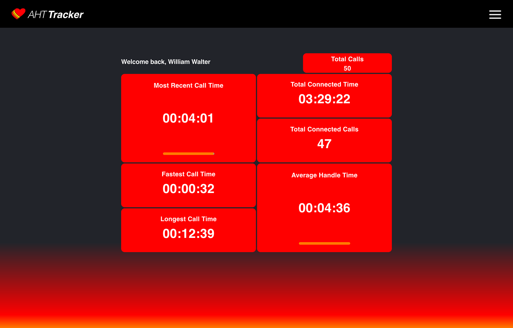

# AHT Tracker

AHT Tracker lets help desk agents track their call data for the day at a glance.

The dashboard lets agents see pertinant session metrics inlcuding:

- Average Handle Time
- Most Recent Call Time
- Connected Duration
- Connected Count
- Fastest Call
- Slowest call 
- Total Calls

"Call History" gives agents access to historical call statistics. Exposing metrics like fastest average handle time, total inbound calls taken, and more. 

Call data is sources from the Webex Search API. When a user access thier dashboard a cloud function transforms, stores, and structures their most recent call data to viewed in the dashboard.

The "raw" data from the Webex Search API is transformed into types objects that are more well suited for an agent's dashboard and Call History.

Firebase auth and firestore are used so agent's can build a log of their calls and see historical data at the click of a button. 